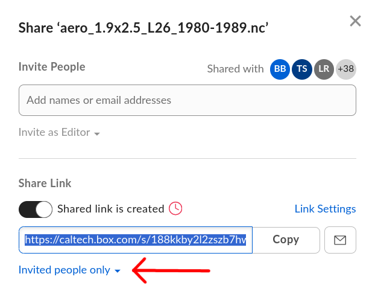
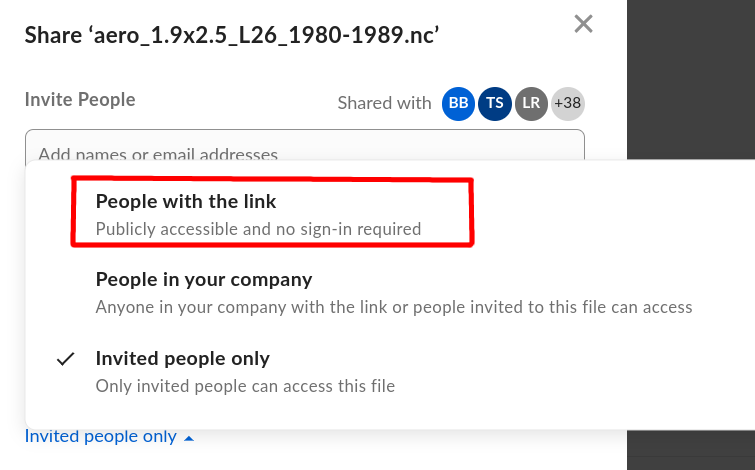
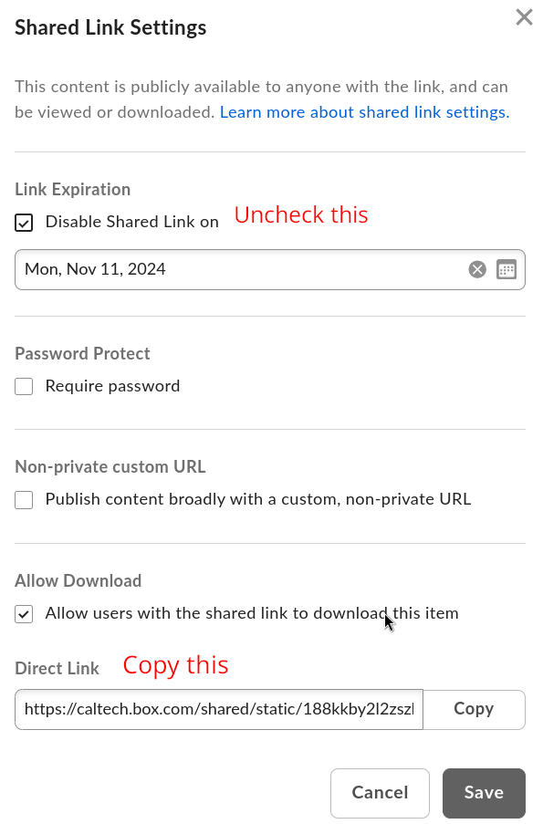

<h1 align="center">
   <br>
ClimaArtifacts

[](https://github.com/CliMA/ClimaArtifacts#frequently-asked-questions)

</h1>

Pre-processing pipelines for the input data used by the CliMA project and
`Artifacts.toml` entry to use those artifacts.

Each folder (except for `ClimaArtifactsHelper.jl`) contains everything that is
needed to produce and use an artifact for CliMA:
- A readme to describe the details,
- `Project.toml` and a `Manifest.toml` files that describe the version of packages required,
- A `create_artifact.jl` Julia script to do the per-processing, optionally
  retrieving the data and creating an `Artifact.toml` entry,
- A `OutputArtifacts.toml` entry that contains the code needed to use that artifact. This is
  produced by the `create_artifact.jl` script.

To use an artifact, copy the content of the `OutputArtifacts.toml` to your
`Artifacts.toml`.

To recreate an artifact, `cd` into the desired folder and run `julia --project
create_artifact.jl`.

The `ClimaArtifactsHelper.jl` contains shared functions used across the various
artifacts.

## Artifacts available

### Atmosphere

- [Aerosol concentrations (monthly mean, decadal averaged from 1970 to 2030)](https://github.com/CliMA/ClimaArtifacts/tree/main/aerosol_concentrations)
- [MERRA-2 Aerosol concentrations (monthly mean 1980 to 2024)](https://github.com/CliMA/ClimaArtifacts/tree/main/merra2_aerosols)
- [Ozone concentrations (monthly mean, from 1850 to 2049)](https://github.com/CliMA/ClimaArtifacts/tree/main/ozone_concentrations)
- [Cloud properties (hourly, 2010)](https://github.com/CliMA/ClimaArtifacts/tree/main/era5_cloud)
- [Temperature average and restart file for ClimaAtmos Held-Suarez perfect model calibration](https://github.com/CliMA/ClimaArtifacts/tree/main/atmos_held_suarez_obs)
- [Large-scale forcing from HadGEM2-A at cfSites for driving single column models in ClimaAtmos.jl](https://github.com/CliMA/ClimaArtifacts/tree/main/cfsite_gcm_forcing)
- [Initial conditions for summer DYAMOND simulations](https:////github.com/CliMA/ClimaArtifacts/tree/main/atmos_dyamond_summer)
- [MERRA-2 Aerosol Diagnostics (monthly mean 1980 to 2024)](https://github.com/CliMA/ClimaArtifacts/tree/main/merra2_AOD)
- [MODIS liquid and ice water path (monthly mean 2002 to 2025)](https://github.com/CliMA/ClimaArtifacts/tree/main/modis_lwp_iwp)
- [CloudSat/CALIPSO 3S-GEOPROF-COMB dataset](https://github.com/CliMA/ClimaArtifacts/tree/main/calipso_cloudsat)

### Land

- [Spun up initial conditions for soil, Jan 1, 2008](https://github.com/CliMA/ClimaArtifacts/tree/main/soil_ic_2008_50m)
- [CLM surface data for the year 2000](https://github.com/CliMA/ClimaArtifacts/tree/main/clm_data)
- [Soil texture parameters needed for the full soil model; derived from SoilGrids](https://github.com/CliMA/ClimaArtifacts/tree/main/soilgrids)
- [Soil parameters needed for Richards equation; global at 1km resolution from
S. Gupta et al 2022, 2024](https://github.com/CliMA/ClimaArtifacts/tree/main/soil_params_Gupta2020_2022)
- [Foliage clumping index, derived from MODIS data for 2006](https:////github.com/CliMA/ClimaArtifacts/tree/main/modis_clumping_index)
- [Leaf area index, derived from MODIS data for 2000-2020](https:////github.com/CliMA/ClimaArtifacts/tree/main/modis_lai)
- [Subset of ILAMB datasets](https:////github.com/CliMA/ClimaArtifacts/tree/main/ilamb_data)
- [Bonan 2019 Richards equation data](https:////github.com/CliMA/ClimaArtifacts/tree/main/bonan_richards_eqn)
- [TwoStream model implementation test data](https:////github.com/CliMA/ClimaArtifacts/tree/main/twostr_test)
- [Berkeley Earth Global Gridded Temperature Data](https:////github.com/CliMA/ClimaArtifacts/tree/main/surface_temperatures)
- [Selected FLUXNET tower data](https:////github.com/CliMA/ClimaArtifacts/tree/main/fluxnet_sites)
- [ESM-SnowMIP data](https://github.com/CliMA/ClimaArtifacts/tree/main/snowmip)
- [ERA5 Monthly Averages 2008](https:////github.com/CliMA/ClimaArtifacts/tree/main/era5_surface_fluxes_2008)
- [Earth bedrock depth at 30 and 60 arc-second resolutions](https:////github.com/CliMA/ClimaArtifacts/tree/main/bedrock_depth)
- [ERA5 Land Forcing Data 2008](https:////github.com/CliMA/ClimaArtifacts/tree/main/era5_land_forcing_data2008)
- [ERA5 Monthly Averages on Pressure Levels 1979-2024](https:////github.com/CliMA/ClimaArtifacts/tree/main/era5_monthly_averages_pressure_levels_1979_2024)
- [TOPMODEL topographic index statistics](https:////github.com/CliMA/ClimaArtifacts/tree/main/topmodel)
- [ERA5 Monthly Averages on Single Levels 1979-2024](https:////github.com/CliMA/ClimaArtifacts/tree/main/era5_monthly_averages_single_level_1979_2024)
- [Lehmann et al. 2008 Fig. 8 evaporation data](https:////github.com/CliMA/ClimaArtifacts/tree/main/lehmann2008_evaporation)
- [Forty years of ERA5 forcing data for ClimaLand](https:////github.com/CliMA/ClimaArtifacts/tree/main/forty_yrs_era5_land_forcing_data)
- [Topo Drag, created with the GDFL model](https:////github.com/CliMA/ClimaArtifacts/tree/main/topo_drag)
- [Water conservation test data for RichardsModel](https:////github.com/CliMA/ClimaArtifacts/tree/main/water_conservation_test)
- [ERA5 LAI Covers](https:////github.com/CliMA/ClimaArtifacts/tree/main/era5_lai_covers)
- [Soil freezing data from Mizoguchi](https:////github.com/CliMA/ClimaArtifacts/tree/main/mizoguchi_soil_freezing_data)
- [Van Genuchten data from Huang](https:////github.com/CliMA/ClimaArtifacts/tree/main/huang_van_genucthen_data)
- [P-model implementation test data](https:////github.com/CliMA/ClimaArtifacts/tree/main/pmodel_unittests)

### Coupler/shared

- [Measured sea ice concentration and sea surface
  temperature](https://github.com/CliMA/ClimaArtifacts/tree/main/historical_sst_sic)
- [GPCP precipitation data](https://github.com/CliMA/ClimaArtifacts/tree/main/precipitation_obs)
- [CERES radiative fluxes data](https://github.com/CliMA/ClimaArtifacts/tree/main/radiation_obs)
- [RMSE for CMIP models](https://github.com/CliMA/ClimaArtifacts/tree/main/cmip_model_rmse)
- [Earth orography at 30 and 60 arc-second resolutions](https:////github.com/CliMA/ClimaArtifacts/tree/main/earth_orography)
- [Monthly Mean CO2 from Mauna Loa](https://github.com/CliMA/ClimaArtifacts/tree/main/co2_dataset)
- [Land-sea mask](https://github.com/CliMA/ClimaArtifacts/tree/main/landsea_mask)
- [Global shortwave albedo](https://github.com/CliMA/ClimaArtifacts/tree/main/sw_albedo)


# The ultimate guide to ClimaArtifacts

Last update: 28 March 2025

If you are a developer, jump to the [For developers](https://github.com/CliMA/ClimaArtifacts#for-developers) section.

## For users

#### What is an artifact?

Artifacts are objects that contain input data for CliMA simulations. CliMA
artifacts leverage the [Julia
artifact](https://docs.julialang.org/en/v1/stdlib/Artifacts/) system for
distribution and validation. When you instantiate a CliMA package, Julia will
automatically download the related input data (if needed).

This repository contains many of the artifacts used by CliMA, alongside with
documentation that describes the data and the scripts to reproduce them.

> [!IMPORTANT]
> Artifacts are always full folders and they can contain any number of files or
> folders.


#### How do I obtain an artifact?

There are two categories of artifacts, _downloadable_ and _undownloadable_. The
difference between the two is the size: _downloadable_ are small enough that
they can be installed automatically, whereas _undownloadable_ need some special
care.

Let us first consider the _downloadable_ artifacts. Most downloadable artifacts
are automatically installed when you instantiate a CliMA package. Other
downloadable artifacts are lazy, meaning that they are downloaded when you first
use them.

Undownloadable artifacts, as the name suggests, cannot be downloaded
automatically. ERA5 data is an examples of undownloadable artifacts: the hourly
data required to force the CliMA land model takes over 2 TB of space.

At the time of writing, undownloadable artifacts can be obtained by running the
associated `create_artifact.jl` in this repository. Here we walk through an
example (obtaining the historical sea surface temperature and sea ice
concentration)

1. Clone this repository: `git clone
   https://github.com/CliMA/ClimaArtifacts.git`. For large artifacts, it is best
   to clone the repository on a drive where you have enough storage space/quota.
   Most of the undownloadable artifacts mention the file size in their README.
2. Navigate to the artifact of interest `cd historical_sst_sic`
3. Instantiate the Julia project: `julia --project=. -e 'using Pkg; Pkg.instantiate()'` 
4. In `create_artifact.jl`, comment out the line with the
   `create_artifact_guided` function (in the future, we will automate this step)
5. Run the `create_artifact.jl` script: `julia --project=. create_artifact.jl`
   This will automatically download and process the data. 
   Note also that some of the artifacts might require some set up (e.g., obtaining
   authentication tokens). These extra steps are explained in the associated README.
> [!WARNING]
> For large datasets and depending on the network speed, this can take several
> hours/days. Refer to the README of the artifact to get a sense of space/time
> required
6. Optionally, move the artifact in your desired location. For example, here we
   will move `historical_sst_sic` to `/my/drive/artifacts/historical_sst_sic`.
7. Once the artifact is created, you need to make it available to Julia. For
   this, navigate to the `artifacts` folder in your Julia depot (typically the
   `.julia` folder): `cd ~/.julia/artifacts`
8. Identify the hash associated to the artifact by looking at the
   `OutputArtifacts.toml` in this repository. In the case of our example, we can
   find it
   [here](https://github.com/CliMA/ClimaArtifacts/blob/3e86f2a4907e2306f80d7fcfcb895461dda729b7/historical_sst_sic/OutputArtifacts.toml#L2),
   and is `0d30d71a6f9b6548fe7395ca647e853ec36d1699`.

9. Add to the `Overrides.toml` file (if such file does not already exist, create
   it) a line that maps the hash with the path on the filesystem of the artifact
   that we produced. In this example, this will look like:
```toml
0d30d71a6f9b6548fe7395ca647e853ec36d1699 = "/my/drive/artifacts/historical_sst_sic"
```

That is it!

Using the hash allows different packages to share the same artifact (while
possibly having different internal names for it).

In the future, when the CliMA model settles to a more stable form, we hope to
provide undownloadable artifacts in a simpler fashion (i.e., without having to
regenerate them). In the meantime, please get in touch if you would like to
receive a copy of some artifacts without regenerating them.

## For developers

#### What is an artifact?

Sometimes, Julia packages require external piece of binary data to work. This
might be a compiled library, a binary blob, or anything else. At CliMA, we use
Julia artifacts to define and manage external data required to run our models
(e.g., the surface albedo of the globe as a function of time).

> [!IMPORTANT]
> While we refer to data as artifacts, technically, Julia artifacts are always
> folders and not single files.

#### As a developer, how do I use an existing artifact?

You can find the list of artifacts associated to a package by looking at its
`Artifacts.toml` file.

Let us consider an example `Artifacts.toml`.
```toml
[era5_static_example]
git-tree-sha1 = "9e0fa7970c5ade600867f5afe737bc3ab6930204"

    [[era5_static_example.download]]
    sha256 = "6c2c3312ff49776ab4d3db7e84ba348dc8e3ffad2d3cb5e77e35039bdeec1610"
    url = "https://caltech.box.com/shared/static/pdsre5tumpc04qbomzjduw07ryd3emwj.gz"

[era5_example]
git-tree-sha1 = "c08d3035085c3c2969d1d9fb6f299686bad8d253"
very_important = "yes"

[socrates]
git-tree-sha1 = "43563e7631a7eafae1f9f8d9d332e3de44ad7239"
lazy = true

    [[socrates.download]]
    url = "https://github.com/staticfloat/small_bin/raw/master/socrates.tar.gz"
    sha256 = "e65d2f13f2085f2c279830e863292312a72930fee5ba3c792b14c33ce5c5cc58"
```

This `Artifacts.toml` defines three distinct artifacts named
`era_static_example`, `era5_example`, and `socrates`. The name is local to this
package and there could be packages with artifacts that share the same names.

Let us focus on the first one,
```toml
[era5_static_example]
git-tree-sha1 = "9e0fa7970c5ade600867f5afe737bc3ab6930204"

    [[era5_static_example.download]]
    sha256 = "6c2c3312ff49776ab4d3db7e84ba348dc8e3ffad2d3cb5e77e35039bdeec1610"
    url = "https://caltech.box.com/shared/static/pdsre5tumpc04qbomzjduw07ryd3emwj.gz"
```
In the brackets, we have the name of the artifact, `era5_static_example`. This
is how we access this artifact from the code in this package (see below). Next,
we have the `git-tree-sha1`, this is a cryptographic hash used to verify the
integrity of the artifact. When the artifact is downloaded, Julia checks that
the hash of the downloaded folder corresponds to one in the `Artifacts.toml`.
The hash is also used to identify the same artifact across different packages
(even if they might have different names), allowing for reuse. The subsequent
section, `[[era5_static_example.download]]`, specifies how to obtain the
artifact.

Now that we have a sense of how an artifact is specified, let us see how to use
it in the code. If we use directly the Julia infrastructure, we can simply import
`Artifacts`:
```julia
using Artifacts
println(artifact"era5_static_example")
# ~/.julia/artifacts/9e0fa7970c5ade600867f5afe737bc3ab6930204
```
Note that `artifact"era5_static_example"`is the path of a folder. The folder
could contain one or multiple files, but it is up to the user to specify which
one they want to access. Suppose this artifact only contains one file,
`era5.nc`, the code to access that file would look like
```julia
using Artifacts
era5_data = joinpath(artifact"era5_static_example", "era5.nc")
# ~/.julia/artifacts/9e0fa7970c5ade600867f5afe737bc3ab6930204/era4.nc
```
This is **not** the preferred way to access artifacts. Instead, we use
`ClimaUtilities.ClimaArtifacts`. This module is MPI safe and allows us to keep
track of what artifacts are being used. When the `ClimaComms` context is not
available or relevant, `ClimaUtilities.ClimaArtifacts` provides a drop-in
replacement for `artifact`:
```julia
using ClimaUtilities.ClimaArtifacts
era5_data = joinpath(@clima_artifact("era5_static_example"), "era5.nc")
# ~/.julia/artifacts/9e0fa7970c5ade600867f5afe737bc3ab6930204/era4.nc
```
If the context is available, it is always best to pass it to (as in
`clima_artifact("era5_static_example", context)`). This ensures that the
acquiring the artifact is MPI-safe.

Let us now look at the second block,
```toml
[era5_example]
git-tree-sha1 = "c08d3035085c3c2969d1d9fb6f299686bad8d253"
very_important = "yes"
```
This second block does not contain a download section. This makes the artifact
undownloadable. This means that Julia will not try to download the artifact.
Instead, the folder has to be acquired in a different way and the path specified
using the `Overrides` mechanism (more on this below). Large artifacts (> 500 MB)
should be marked as undownlodable. If you are using the Caltech cluster, all the
undownloadable artifacts have been handled for you and there is nothing else you
have to do. You can use undownloadable artifacts exactly in the same way you would
use downlodable one (ie, with `@clima_artifacts`).

This second block also has an additional tag, `very_important = "yes"`. We are
free to add any extra information to the `Artifacts.toml`.

Finally, the last block introduces us to a new tag, `lazy = true`. This
annotation marks the artifact as lazy: instead of being downloaded upon
instantiation, it is downloaded the first time is used. To use this we must pass
the `ClimaComms` context and also load the `LazyArtifacts` package.
```julia
using LazyArtifacts
using ClimaUtilities.ClimaArtifacts
socrates = joinpath(@clima_artifact("socrates"), "apology.txt")
```

#### How to download an undownloadable artifact?

If you are on the Caltech cluster, some has already downloaded and configured
everything for you (see below on how this is done in practice). If you are using
a different machine, you will have to create a file `Overrides.toml` in the
`artifacts` folder of your depot (typically `~/.julia`). The `Overrides.toml`
provides a map between `git-tree-sha1`s to paths. The simplest `Overrides.toml`
might look like
```toml
c08d3035085c3c2969d1d9fb6f299686bad8d253 = "/path/to/era5folder"
```
This `Overrides.toml` binds the artifact with id
`c08d3035085c3c2969d1d9fb6f299686bad8d253` to a specific folder on your machine.
Now, it is up to you to fill the folder with the correct files. You should add
bindings for all the undownloadable artifacts you want to use in your
simulations.

#### As a developer, how do I add a new ClimaArtifact?

CliMA artifacts must be reproducible, respect the licenses under which original
data is released, and be consistent across different repositories. The
`ClimaArtifacts` repository collects the pipelines and environments used to
produce data, as well as tools to help creating Julia artifacts. In
`ClimaArtifacts`, we focus on artifacts that are important for a full Earth
System Model, especially those that might be shared across components.

To create a new artifact in `ClimaArtifacts`:
1. Clone the `ClimaArtifacts` repository
2. Create a new folder with the name of your artifact, e.g., `dormouse1819`
3. Create a new Julia project with the script that acquires and processes the
   data. The script should save all the new data files into a new folder. Such
   folder will become the artifact (remember, Julia artifacts are always folder)
4. At the end of your script, call `create_artifact_guided(folder_path;
   artifact_name = basename(@__DIR__))`
5. The `create_artifact_guided` starts a guided process that gives you the
   string to put in your `Artifacts.toml` files.

If you are using `Downloads.jl`, you can use `download_rate_callback` to display
the download rate and progress. An example of its usage is:

```julia
using Downloads
using ClimaArtifactsHelper
Downloads.download("https://www.foo.bar/baz.png"; progress = download_rate_callback())
```

If you are creating multiple artifacts from the same file, consider adding
`append = true` to ensure that the `OutputArtifacts.toml` has all the
information.

If your artifact is tied to your particular module, you may elect to add it to
your repository instead. To do so, follow the same steps above with the
exception that you have to create a new `artifacts` folder (if one does not
already exist) and create `dormouse1819` in there. You can obtain
`ClimaArtifactsHelper.jl` with:
``` julia
using Pkg
Pkg.develop(url="https://github.com/CliMA/ClimaArtifacts.git", subdir="ClimaArtifactsHelper.jl")
```
The other steps are the same.

The `create_artifact_guided` behaves differently depending on the size of the
artifact. For small artifacts, it creates and archive, prompt you to upload the
archive to the correct place, computes the hash, and validates that the archive
can be correctly downloaded and corresponds to the hash.

For large artifacts, we rely on the `Overrides.toml` mechanism described in the
previous section. In this case, you will have to copy the data to the
`/groups/esm/ClimaArtifacts/artifacts` folder on the cluster and add a new entry
to the `Overrides.toml` that lives there. Add a line of comment to tell others
about your new artifact and where it is used.

To test that your artifact works, create a new folder, e.g., `/tmp/mynewfolder`,
create an `Artifacts.toml` file in it, the content of which has to be the
`OutputArtifacts.toml` file created by the `create_artifact_guided` function.
Then, call `julia --project -e 'using Artifacts; println(artifact"AAAAAA")'` from
that folder, where `AAAAAA` is the name of your artifact. It should print
`/groups/esm/ClimaArtifacts/artifacts/AAAAAA`, where `AAAAAA` is the folder you
just uploaded.

#### What is a _undownloadable_ artifact? Why do we need them?

`ClimaArtifacts` treats small and big files differently.

Small files are uploaded to network-accessible location. When a package using
these artifacts is registered, these files are also mirror by the Julia storage
servers. Users automatically obtain the artifact upon package instantiation (if
not lazy) or when first used (if lazy). When the artifact is obtained, its
integrity is also verified by computing a cryptographic hash and check it
against a known value.

Many of the above-described features that small files easy to use and
worry-free, become a problem for large files:
1. Mirroring large files on the Julia servers is not an acceptable use of shared
   resources;
2. Automatically download large files greatly increases the instantiation time;
3. Computing cryptographic hashes for large files can take a long time.

In addition to this, we do not want to hide the location of the large files and
we want to let users pick the location. This is because home directories might
have limited storage space, and more generally users might want to decide where
to save large files. This is especially on clusters, where homes are small and
groups might decide to save the input files in folders shared across users.

#### How to upload on the Caltech Box?

Go to [Caltech Box](https://caltech.app.box.com/). Navigate to your favorite
folder and upload your data. Once the data is uploaded, you have to make it
shareable. Click on the sharing icon on the right, the following screen will pop
up:



Change from "Invited people only to" "People with link"



If the screen says that you don't have permission, go back and check that you
selected "People with link" in the previous step.

Next, go on "Link Settings", and disable "Disable Shared Link on". Copy the
Direct Link at the bottom



#### How are artifacts managed on the Caltech cluster?

We do not want to keep downloading the same artifacts over and over, especially
when they are large in size. So, on the Caltech cluster, we store them in a
folder and point the `Artifacts` system to that folder. This section describes
how this is accomplished.

The implementation of the system that allows a centrally-managed artifact system
relies on the `ClimaModules`. We install and maintain our version of Julia,
which is accessible to users via `ClimaModules`. This allows us to execute code
upon startup to customize the behavior of Julia for all our users. This is
accomplished by editing the `/etc/julia/startup.jl` file. In particular, we are
going to add a new entry to the `Base.DEPOT_PATH` vector to point to
`/groups/esm/ClimaArtifacts`. So, we add a new line to the shared `startup.jl`:
```
push!(Base.DEPOT_PATH, "/groups/esm/ClimaArtifacts")
```
This adds `/groups/esm/ClimaArtifacts` as depot with lowest priority.
In`/groups/esm/ClimaArtifacts`, there is a folder `artifacts`, which contains
the data and contains a `Overrides.toml` that is loaded by all users. In this way,
every user will automatically have access to all the artifacts available on the
system.

> Q: Why are we using the `startup.jl`instead of using system-wide depot?

> A: Typically, `Base.DEPOT_PATH` contains two depots that are "system-wide"
> (ie, meant to be managed by the system administrators). Unfortunately,
> changing the `JULIA_DEPOT_PATH` resets `Base.DEPOT_PATH`, so that the system
> depots are ignored. We use `JULIA_DEPOT_PATH` extensively in `slurm-buildkite`.


## Frequently Asked Questions

### `ClimaArtifactsHelper` is not able to load my artifact

One of the most common reasons for that is malformed Box links. Your Box link should look something like
```
https://caltech.box.com/shared/static/pdsre5tumpc04qbomzjduw07ryd3emwj.gz
```
It has to have a `/shared/static` portion and an extension. If that's not the
case, chances are you copied the link from the wrong page. Make sure you are in
the "Link Settings" page (see screenshot above).

### I just want to create an artifact with one file

If you want to create an artifact with only one file, you can use the
`crate_artifact_guided_one_file` function.

For example:

``` julia
using ClimaArtifactsHelper

const FILE_URL = "https://svn-ccsm-inputdata.cgd.ucar.edu/trunk/inputdata/lnd/clm2/surfdata_map/surfdata_0.9x1.25_hist_17pfts_nocft_CMIP6_simyr1700_c230809.nc"
const FILE_PATH = "surfdata_0.9x1.25_hist_17pfts_nocft_CMIP6_simyr1700_c230809.nc"

create_artifact_guided_one_file(FILE_PATH; artifact_name = basename(@__DIR__), file_url = FILE_URL)
```

### Credits

The logo contains elements designed by Adrien Coquet.
