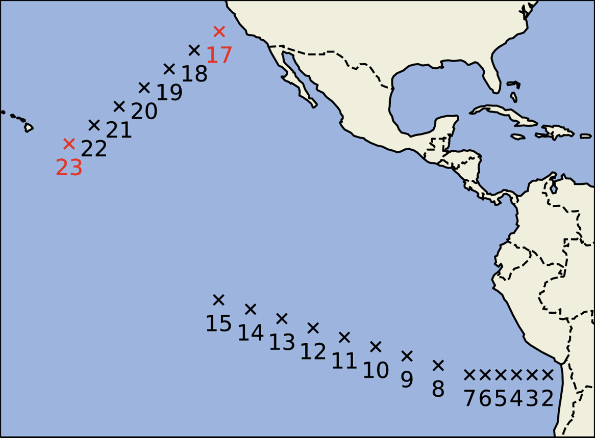

# CfSite GCM forcing 

This artifact is derived from HadGEM2-A and contains large-scale forcing to drive single-column models for several cfSites. These locations in the East Pacific Ocean focus on reproducing the stratocumulus (site 17) to shallow cumulus (site 23) transition and are important to model accurately for the global energy budget. The artifact contains variables measured every 6 hours in July from the years 2004 to 2008 (600 total time windows) at the following 21 sites shown below. The artifact is currently being used in [ClimaAtmos](https://github.com/CliMA/ClimaAtmos.jl) to force single column simulations. 
<p align="center">
   

  Figure from [Shen et al., 2022](https://doi.org/10.1029/2021MS002631) depicting the locations of the 21 cfSites contained in this dataset. 
</p>

The dataset contains the following time and height varying variables at each location. Please refer to the standard CMIP naming conventions [here](https://airtable.com/appYNLuWqAgzLbhSq/shrKcLEdssxb8Yvcp/tblL7dJkC3vl5zQLb) for more details on each variable. Variables below are measured at each of the 38 heights, and include the atmospheric state and large-scale forcing:

```julia
zg, ta, hus, ua, va, wap, cl, cli, clw, hur, tnta, tnhusa, pfull, alpha, tntwork, tntva, tnhusva, tntha, tnhusha, tntr, th, thli 
```

It also contains time-only varying variables, such as surface temperature (`ts`) and precipitation (`pr`): 
```julia
ps, ts, rsdt, hfls, hfss, pr, rsut, rsutcs, rlut, rlutcs, clwvi, clivi, lwp3000
```

As well as static variables: 
```julia
label, coszen, gustiness, windstd, windrms
```

License: Creative Commons Attribution-Noncommercial-Noderivatives 4.0 International