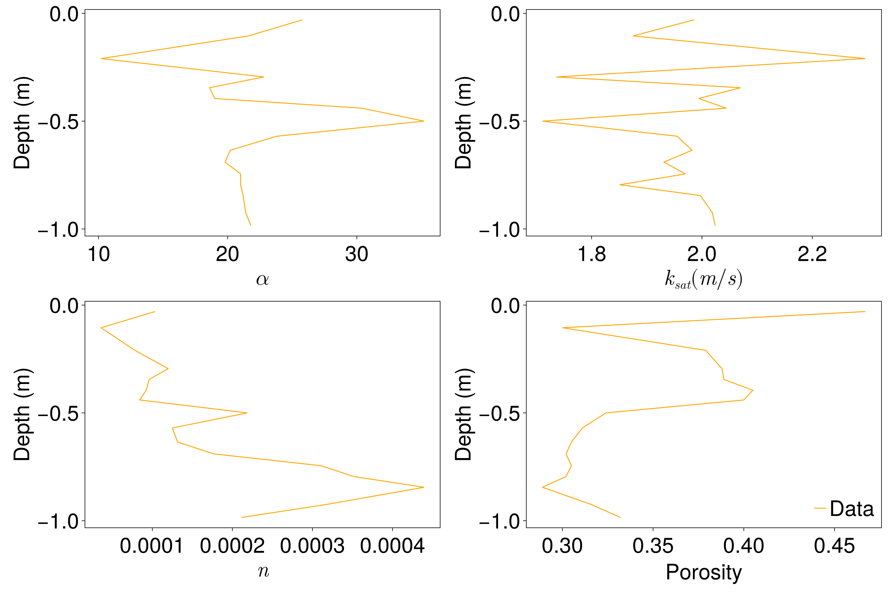

# Van Genuchten data from Huang, 2011

This artifact contains soil van Genuchten parameters as a function of depth for
soil from site SV62 in Fort McMurray, Alberta, Canada.

The data was originally collected by Huang, Mingbin, et al. [1], and is
available in Table 1B. The CliMA team transcribed the data and compiled this
artifact.

If used, please cite the following:

[1]: Huang, Mingbin, et al, 2011. Infiltration and drainage processes in multi-layered coarse soils, Canadian Journal of Soil Science, 91.2, 169-183,https://doi.org/10.4141/cjss09118
