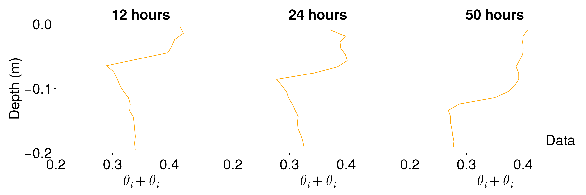

# Soil freezing data from Mizoguchi, 1990

This artifact contains soil volumetric water content as a function of depth and
time during the freezing soil column experiment described in M. Mizoguchi's
Ph.D. thesis [1].

The data for artifact was obtained by the CliMA team from Figure 4 of reference
[2] using a plot digitizer. No error bars were reported, and we haven't
quantified the error in our estimation of the data from images.

If used, please cite the following:

[1]: Mizoguchi, M., 1990. Water, heat and salt transport in freezing soil, Ph.D. thesis. (In Japanese.) University of Tokyo, Tokyo.

[2]: Hansson, Klas, et al., 2004, Water flow and heat transport in frozen soil: Numerical solution and freeze–thaw applications, Vadose Zone Journal 3.2, 693-704
