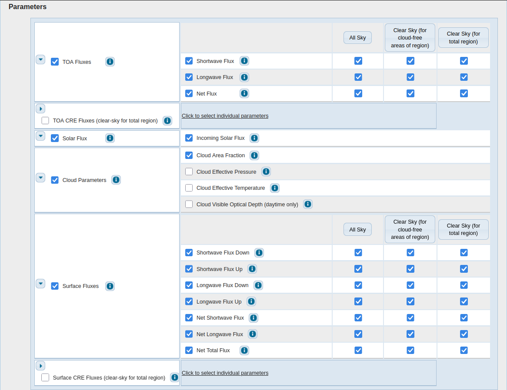
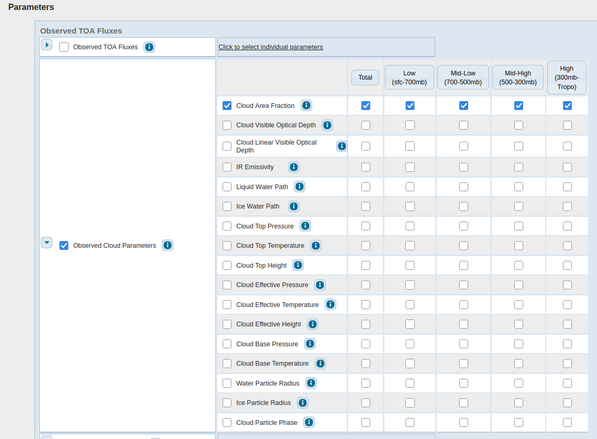

# Radiative fluxes data from CERES

This artifact contains monthly mean top-of-the-atmosphere and surface radiative
fluxes from the Clouds and Earth's Radiant Energy Systems (CERES) Energy
Balanced and Filled (EBAF) from March 2000 to December 2025. The data includes
incoming solar flux, upward shortwave and longwave radiative fluxes, net
radiative fluxes for all-sky and clear-sky conditions, and cloud area fractions.
The net radiative fluxes is positive downward. The resolution is 1 deg x 1 deg.
All fluxes are in W m-2. The cloud area fractions are in percentage.
The data was downloaded from [CERES website](https://ceres.larc.nasa.gov/data/)
in June 2026.

The names of the datasets are `CERES_EBAF_Ed4.2.1_Subset_200003-202512.nc`for
the radiative fluxes and
`CERES_SYN1deg-Month_Terra-Aqua-NOAA20_Ed4.2_Subset_200003-202512.nc` for the
cloud area fractions.

# Prerequisites

1. Julia 1.12

# Instructions

1. Go to https://ceres.larc.nasa.gov/data/#ebaf-level-3
2. If you have not already, make an account to be able to download the data.
3. Click on "Order data" next to EBAF  –  Level 3b.
4. Select the following parameters as shown in the screenshot below.

For the temporal resolution, choose "Monthly mean" and for the spatial
resolution, choose "Regional (1° x 1° global grid)". For the time range, choose
the widest possible time range.

5. Click on the "Add to Cart" button at the bottom of the page.
6. Go to https://ceres.larc.nasa.gov/data/#syn1deg-level-3.
7. Click on "Order data" next to EBAF  –  Level 3b.
8. Select the following parameters as shown in the screenshot below.

For the temporal resolution, choose "Monthly" and for the spatial
resolution, choose "Regional (1° x 1° global grid)". For the time range, choose
the widest possible time range.

9. Click on the "Add to Cart" button at the bottom of the page.

6. Click on the "Shopping Cart" button at the top of the page.
7. In the product info column, choose to save the files as yearly and the output
   format as netcdf4 for both data products.
8. Submit order and wait for the order to complete
9. You should get an email sent to you with the subject "Your order is
completed". Download the text file to this directory and rename it to
"radiation_obs.txt".
9. Navigate to this directory in the terminal.
10. Run `julia --project=. create_artifact.jl".

# Post-processing

The original source was provided as a list of multiple NetCDF files. The only
preprocessing done was to concatenate all the NetCDF files along the time
dimension for each dataset and to replace all missing values with `NaN`s.

# License

License: Creative Commons Zero
